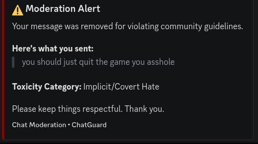
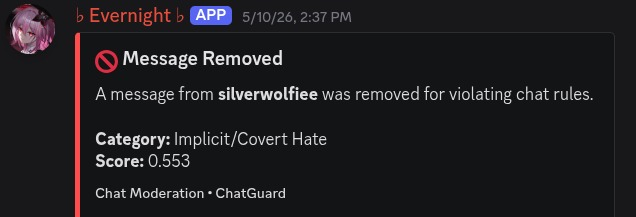

# A toxic detection Model for my upcoming mandatory Research project.

The model aims to also detect implicit hate by taking context into consideration utilizing transformer models(DistilBERT)

## To-Do : 
1. :)

## Dataset source : 
[Kaggle](https://www.kaggle.com/datasets/julian3833/jigsaw-toxic-comment-classification-challenge?select=train.csv)


## Notes
The project has concluded, However if you have a new suggestion on how to improve the model you can always open a pull request/issue to further improve the accuracy of the toxic detection.

This project is aimed to create an API anyone can use for their toxicity moderation. 

In this project, the API Server i used is ElysiaJS but you can use any backend server to call to model with a FAST API bridge

## Project Structure
```
├── API
│   ├── bun.lock
│   ├── docker-compose.yml
│   ├── Dockerfile.elysia
│   ├── Dockerfile.python
│   ├── package.json
│   ├── __pycache__
│   │   └── server.cpython-312.pyc
│   ├── README.md
│   ├── server.py
│   ├── src
│   │   └── index.ts
│   └── tsconfig.json
├── data
│   ├── checklist
│   │   ├── counterfactual_results.csv
│   │   ├── dir_results.csv
│   │   ├── interpretability_summary.json
│   │   ├── inv_results.csv
│   │   ├── mft_results.csv
│   │   └── summary.json
│   └── processed
│       └── train_cleaned.csv
├── datasets
│   └── train.csv
├── .gitattributes
├── .gitignore
├── models
│   └── distilbert_toxicity_best.pt
├── notebooks
│   ├── checklist.ipynb
│   ├── data_preprocessing.ipynb
│   ├── interpretability.ipynb
│   └── model_training.ipynb
├── readme.md
├── requirements.txt
├── results
│   └── figures
│       ├── lfi_1.png
│       ├── lfi_2.png
│       ├── lfi_3.png
│       └── lfi_4.png
└── utils
    ├── model.py
    └── __pycache__
        └── model.cpython-312.pyc

14 directories, 33 files
```


## Result Example

### Discord Bot Implementation

 <br>
[Evernight-bot](https://github.com/SilverWolfiee/evernight-bot)
